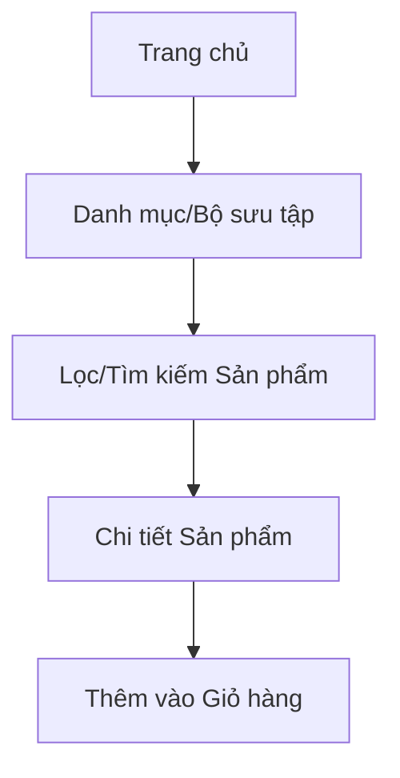
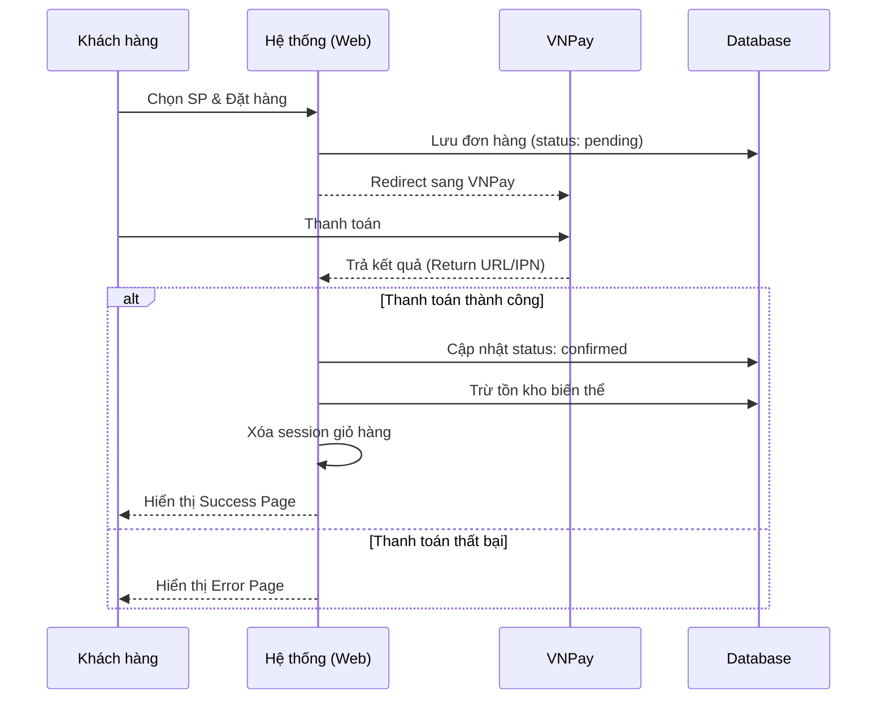
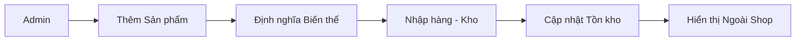

# PHÂN TÍCH CÁC LUỒNG HOẠT ĐỘNG CHÍNH - DỰ ÁN SHOP_QUANAO

Tài liệu này cung cấp cái nhìn tổng quan về kiến trúc và các luồng nghiệp vụ cốt lõi trong hệ thống quản lý shop quần áo (web_qlsp).

---

## 1. Kiến trúc Hệ thống (MVC Pattern)
Dự án được xây dựng theo mô hình Model-View-Controller (MVC) tự chế (custom MVC):
- **Core (Hạt nhân):** 
    - `app.php`: Bộ điều phối (Dispatcher) phân tích URL để gọi đúng Controller/Action. Phân loại luồng theo Web Customer, Web Admin và API.
    - `controllers.php` / `controllers_customer.php`: Các base class cung cấp hàm `model()` và `view()`.
- **Thư mục Controllers:**
    - `MVC/Controllers/Customer/`: Chứa logic giao diện người dùng (Frontend).
    - `MVC/Controllers/`: Chứa logic giao diện quản trị (Backend/Admin).
    - `MVC/Controllers/api/`: Các điểm cuối (endpoints) trả về dữ liệu JSON cho các tác vụ không tải lại trang.
- **Thư mục Model:** Chứa các class tương tác trực tiếp với Database thông qua thư viện MySQLi.

---

## 2. Luồng Hoạt động của Khách hàng (Customer Journey)

### A. Luồng Tìm kiếm và Khám phá Sản phẩm
1. **Trang chủ (`home`):** Hiển thị Banner quảng cáo, sản phẩm mới, và các bộ sưu tập nổi bật.
2. **Danh sách sản phẩm (`product_list_customer`):**
    - Người dùng có thể lọc theo: Danh mục, Bộ sưu tập, Khoảng giá, và Sắp xếp (mới nhất, giá tăng/giảm).
    - **AJAX Flow:** Khi thay đổi bộ lọc, Controller gọi `api_get_data` để tải sản phẩm mà không reload trang.
3. **Chi tiết sản phẩm (`product_detail`):** 
    - Hiển thị thông tin chi tiết, các biến thể (Màu sắc, Kích cỡ) và hình ảnh tương ứng.
    - Cho phép khách hàng xem đánh giá (`reviews`).

### B. Luồng Giỏ hàng và Thanh toán (Core Flow)
1. **Thêm vào giỏ (`cart`):** Thông tin sản phẩm + Biến thể được lưu vào `$_SESSION['cart']`.
2. **Kiểm tra giỏ hàng:** Người dùng xem, cập nhật số lượng hoặc xóa sản phẩm.
3. **Thanh toán (`payment`):**
    - Người dùng nhập thông tin giao hàng.
    - Hệ thống tạo đơn hàng trong Database với trạng thái `pending`.
    - **Tích hợp VNPay:** 
        - Redirect sang cổng thanh toán VNPay.
        - Xử lý kết quả trả về tại `payment/return`.
        - **Cập nhật quan trọng:** Nếu thanh toán thành công, hệ thống tự động **trừ số lượng tồn kho** của các biến thể tương ứng và xóa giỏ hàng session.

### C. Luồng Quản lý Tài khoản
- **Đăng ký/Đăng nhập:** Phân quyền người dùng (Role: `admin` hoặc `customer`).
- **Hồ sơ (`profile`):** Quản lý thông tin cá nhân và tích lũy điểm thưởng.
- **Đơn hàng của tôi (`your_order`):** Theo dõi lịch sử mua hàng và tình trạng đơn hàng.

---

## 3. Luồng Hoạt động của Quản trị viên (Admin Management)

### A. Luồng Quản lý Sản phẩm và Kho hàng
1. **Quản lý danh mục/Sản phẩm:** Admin thêm mới sản phẩm, tải lên hình ảnh và định nghĩa các biến thể (size/color).
2. **Nhập kho (`import` & `warehouse`):** 
    - Luồng này theo dõi số dư tồn kho. 
    - Admin thực hiện nhập hàng để tăng số lượng stock cho các biến thể.
    - Cảnh báo sản phẩm sắp hết hàng.

### B. Luồng Xử lý Đơn hàng và Doanh thu
1. **Quản lý đơn hàng (`orders`):** Admin phê duyệt đơn hàng, cập nhật trạng thái vận chuyển.
2. **Báo cáo doanh thu (`revenue` & `overview`):** 
    - Thống kê doanh số theo ngày/tháng/năm.
    - Biểu đồ Dashboard hiển thị các chỉ số kinh doanh then chốt.

### C. Luồng Marketing và Tương tác
- **Vouchers:** Tạo và quản lý mã giảm giá (giảm theo % hoặc số tiền cố định).
- **Campaigns & Banners:** Cấu hình các chiến dịch sale và thay đổi hình ảnh trang chủ.
- **Reviews:** Kiểm soát và phản hồi bình luận của khách hàng để nâng cao uy tín shop.

---

## 4. Cơ chế Xử lý Dữ liệu AJAX & AI (Đặc thù)
- **ajax_ai.php:** Dự án có một tệp xử lý riêng cho các tác vụ hỗ trợ AI hoặc các tác vụ AJAX tổng hợp, giúp nâng cao trải nghiệm người dùng (UX) bằng cách xử lý nền các yêu cầu phức tạp.

---

> [!TIP]
> **Nhận xét:** Dự án có cấu trúc phân tách rõ ràng giữa Admin và Customer. Đặc biệt luồng **Thanh toán - Trừ kho** được xử lý chặt chẽ để đảm bảo tính nhất quán dữ liệu.
